<div align="center">

<!-- BANNER -->


<br/>
<br/>

# 🚗 On-Road Vehicle Breakdown Assistance Finder

### *Connecting stranded motorists with nearby mechanics — instantly.*

<br/>

<!-- BADGES -->
[](https://laravel.com)
[](https://php.net)
[](https://mysql.com)
[](https://getbootstrap.com)
[](LICENSE)
[](https://vijaymahes9080.github.io/On-Road-Vehicle-Breakdown-Assistance-Finder-Web-System-php/)

<br/>

[🌐 View Live Demo](https://vijaymahes9080.github.io/On-Road-Vehicle-Breakdown-Assistance-Finder-Web-System-php/) &nbsp;·&nbsp;
[🐛 Report Bug](https://github.com/vijaymahes9080/On-Road-Vehicle-Breakdown-Assistance-Finder-Web-System-php/issues) &nbsp;·&nbsp;
[✨ Request Feature](https://github.com/vijaymahes9080/On-Road-Vehicle-Breakdown-Assistance-Finder-Web-System-php/issues)

</div>

---

## 📸 Gallery

<div align="center">

<table>
  <tr>
    <td width="33%">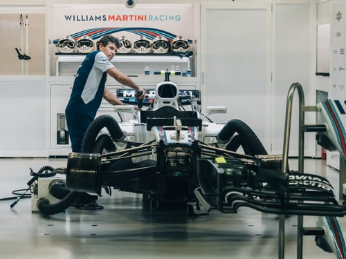</td>
    <td width="33%">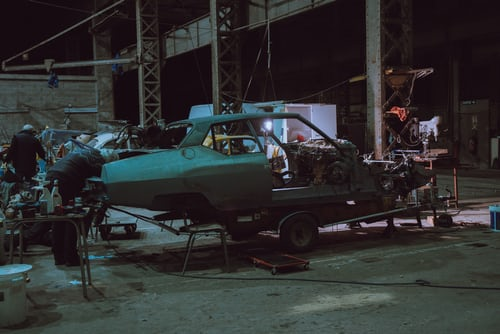</td>
    <td width="33%">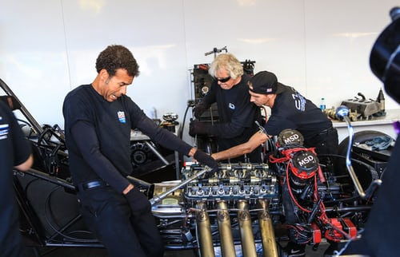</td>
  </tr>
  <tr>
    <td width="33%">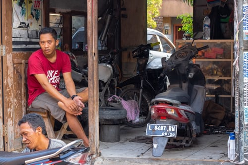</td>
    <td width="33%"></td>
    <td width="33%">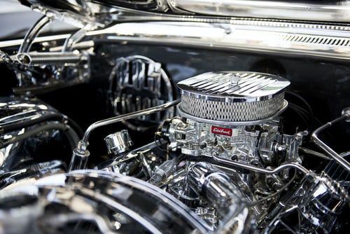</td>
  </tr>
</table>

</div>

---

## 📌 About The Project

> **Breaking down shouldn't mean being stranded.**

When a vehicle fails on the road, finding reliable help is stressful, costly, and time-consuming. **ORVR** bridges that gap — connecting motorists to certified, nearby mechanics through a clean and fast web interface.

<div align="center">

<table>
  <tr>
    <td align="center" width="33%">
      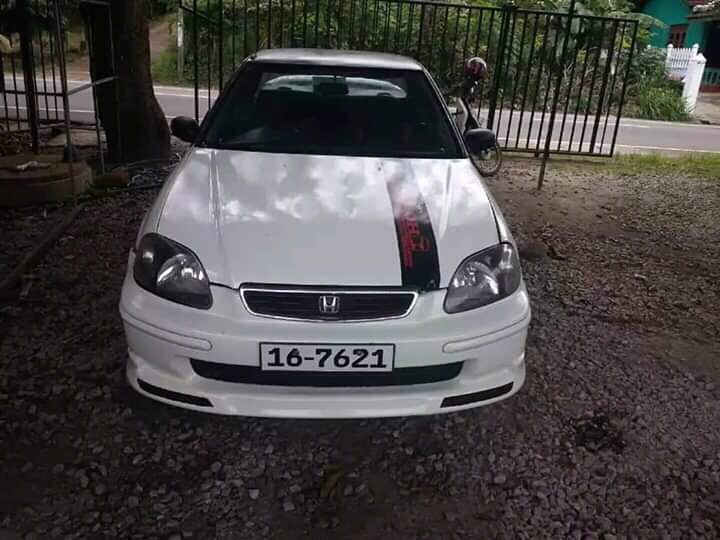<br/>
      <b>👤 Customer Portal</b><br/>
      <sub>Search, request & track mechanics</sub>
    </td>
    <td align="center" width="33%">
      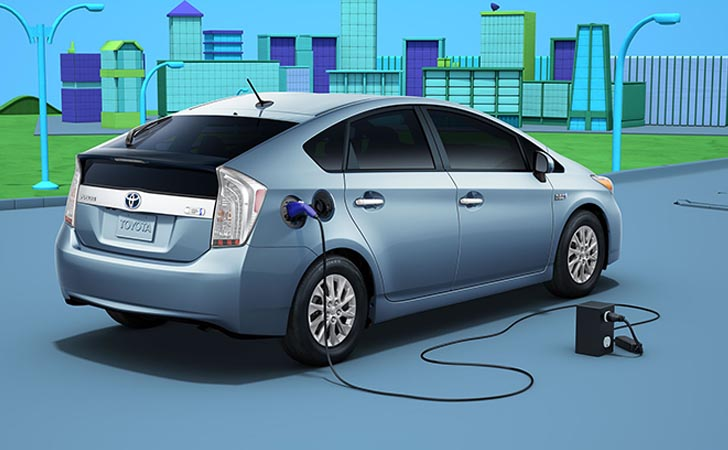<br/>
      <b>🔧 Mechanic Portal</b><br/>
      <sub>Accept jobs & message clients</sub>
    </td>
    <td align="center" width="33%">
      <br/>
      <b>🛡️ Admin Dashboard</b><br/>
      <sub>Moderate users & view reports</sub>
    </td>
  </tr>
</table>

</div>

---

## ✨ Key Features

<div align="center">

| 🔐 Multi-Role Auth | 📍 Location Search | 💬 Messaging | ⭐ Ratings |
|:------------------:|:-----------------:|:------------:|:----------:|
| Customer · Mechanic · Admin portals | Find help near your breakdown zone | Real-time in-app chat | Rate mechanics post-service |

| 📩 Service Requests | 🛠️ Admin Panel | 📊 Reports | 🔔 Notifications |
|:-------------------:|:--------------:|:----------:|:----------------:|
| Submit & track repairs | Manage users & mechanics | Activity analytics | Instant job alerts |

</div>

---

## 🛠️ Tech Stack

<div align="center">


</div>

<br/>

| Layer              | Technology                  |
|--------------------|-----------------------------|
| **Backend**        | Laravel 6.x (PHP 7.2+)      |
| **Frontend**       | Blade Templates + Bootstrap 4 |
| **Database**       | MySQL / MariaDB              |
| **Auth**           | Laravel Multi-Guard Auth     |
| **Build Tool**     | Laravel Mix / Webpack        |
| **Package Mgr**    | Composer + NPM               |

---

## 🖼️ More Screenshots

<div align="center">

<table>
  <tr>
    <td width="50%"><br/><p align="center"><b>🔐 Login Interface</b></p></td>
    <td width="50%">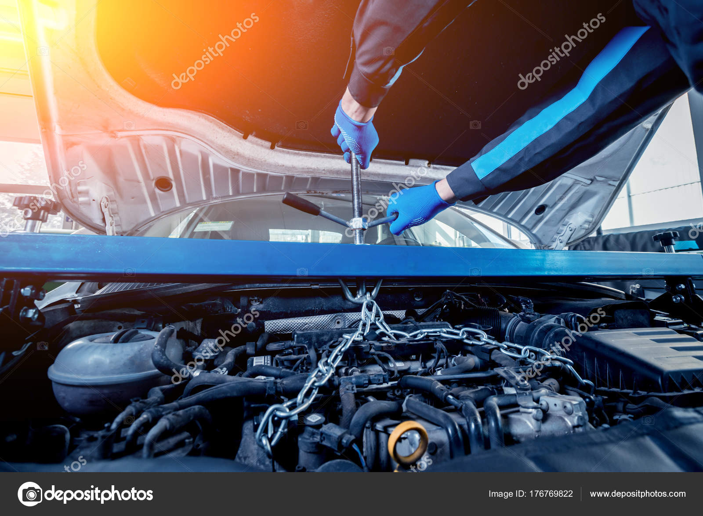<br/><p align="center"><b>🗺️ Location & Services</b></p></td>
  </tr>
  <tr>
    <td width="50%"><br/><p align="center"><b>🔧 Mechanic Profile View</b></p></td>
    <td width="50%"><br/><p align="center"><b>📊 Dashboard Analytics</b></p></td>
  </tr>
</table>

</div>

---

## 📂 Project Structure

```
On-Road-Vehicle-Breakdown-Assistance-Finder-Web-System/
├── 📁 app/
│   ├── 🧩 Admin.php               # Admin model
│   ├── 🧩 Mechanic.php            # Mechanic model
│   ├── 🧩 User.php                # Customer model
│   ├── 🧩 Feedback.php            # Feedback & ratings model
│   ├── 🧩 Requests.php            # Service request model
│   ├── 🧩 Messages.php            # In-app messaging model
│   └── 📁 Http/Controllers/       # All route controllers
├── 📁 config/                     # App configuration
├── 📁 database/
│   ├── 📁 migrations/             # DB schema migrations
│   └── 📁 seeds/                  # Database seeders
├── 📁 docs/                       # Static GitHub Pages demo
├── 📁 public/                     # Web-accessible assets
├── 📁 resources/
│   ├── 📁 views/
│   │   ├── 📁 admin/              # Admin panel views
│   │   ├── 📁 customer/           # Customer portal views
│   │   ├── 📁 mechanic/           # Mechanic portal views
│   │   ├── 📁 auth/               # Login & register views
│   │   └── 📁 layouts/            # Shared layout templates
│   ├── 📁 js/                     # JavaScript source files
│   └── 📁 sass/                   # SCSS stylesheets
├── 📁 routes/web.php              # Application routes
├── 📁 SQL DATABASE/               # SQL dump for import
├── 📁 storage/                    # Logs, cache, uploads
├── 📁 tests/                      # Automated tests
├── 📄 .env.example                # Environment template
├── 📄 composer.json               # PHP dependencies
└── 📄 webpack.mix.js              # Asset bundling config
```

---

## ⚙️ Installation & Setup

### Prerequisites
Make sure you have the following installed:


### Step-by-Step

```bash
# 1️⃣  Clone the repository
git clone https://github.com/vijaymahes9080/On-Road-Vehicle-Breakdown-Assistance-Finder-Web-System-php.git
cd On-Road-Vehicle-Breakdown-Assistance-Finder-Web-System-php

# 2️⃣  Install PHP dependencies
composer install

# 3️⃣  Install Node.js dependencies
npm install

# 4️⃣  Copy environment config
cp .env.example .env

# 5️⃣  Generate application key
php artisan key:generate
```

### 🗄️ Database Setup

Edit `.env` with your credentials:

```env
DB_CONNECTION=mysql
DB_HOST=127.0.0.1
DB_PORT=3306
DB_DATABASE=your_database_name
DB_USERNAME=your_username
DB_PASSWORD=your_password
```

Import the SQL dump from the `SQL DATABASE/` folder:

```bash
mysql -u root -p your_database_name < "SQL DATABASE/vbs.sql"
```

### 🚀 Launch

```bash
npm run dev          # Build frontend assets
php artisan serve    # Start dev server → http://localhost:8000
```

---

## 👥 User Roles & Portals

<div align="center">

<table>
  <tr>
    <td align="center"><br/><b>Customer</b><br/><sub>Search & Request</sub></td>
    <td align="center"><br/><b>Mechanic</b><br/><sub>Accept & Serve</sub></td>
    <td align="center"><br/><b>Admin</b><br/><sub>Manage & Monitor</sub></td>
  </tr>
</table>

| Role         | Default Route          | Capabilities                                          |
|:-------------|:-----------------------|:------------------------------------------------------|
| 👤 Customer  | `/home`                | Search mechanics, submit requests, message, rate      |
| 🔧 Mechanic  | `/mechanic/dashboard`  | Accept/decline jobs, manage profile, chat             |
| 🛡️ Admin    | `/admin/dashboard`     | Full platform control — users, mechanics, reports     |

</div>

---

## 🤝 Contributing

Contributions are welcome and appreciated! 🙏

```
1. 🍴 Fork this repository
2. 🌿 Create your branch  →  git checkout -b feature/AwesomeFeature
3. 💾 Commit your changes →  git commit -m "Add AwesomeFeature"
4. 📤 Push to the branch  →  git push origin feature/AwesomeFeature
5. 🔁 Open a Pull Request
```

---

## 👤 Author

<div align="center">

<br/>

**Vijay Mahes**

[](https://github.com/vijaymahes9080)
[](https://github.com/vijaymahes9080/On-Road-Vehicle-Breakdown-Assistance-Finder-Web-System-php)
[](https://vijaymahes9080.github.io/On-Road-Vehicle-Breakdown-Assistance-Finder-Web-System-php/)

</div>

---

## 📄 License

<div align="center">

This project is licensed under the **MIT License** — see the [LICENSE](LICENSE) file for details.

[](LICENSE)

</div>

---

<div align="center">

### 🚘 More Images from the System

<table>
  <tr>
    <td></td>
    <td>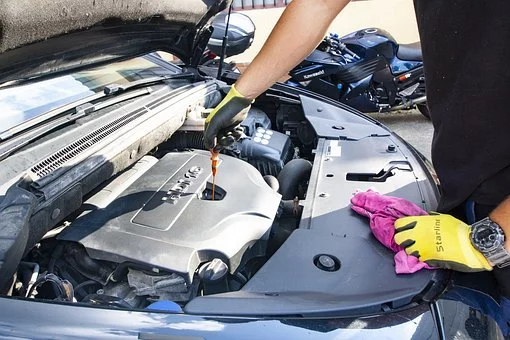</td>
    <td>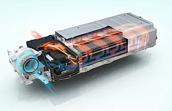</td>
    <td></td>
  </tr>
  <tr>
    <td></td>
    <td></td>
    <td>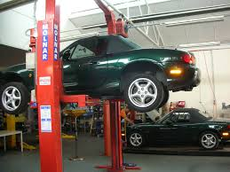</td>
    <td></td>
  </tr>
</table>

<br/>

> ⚠️ **Note:** Never commit your `.env` file — it contains sensitive credentials.
> Always use `.env.example` as a safe configuration template.

<br/>

*Made with ❤️ by [Vijay Mahes](https://github.com/vijaymahes9080)*

</div>
